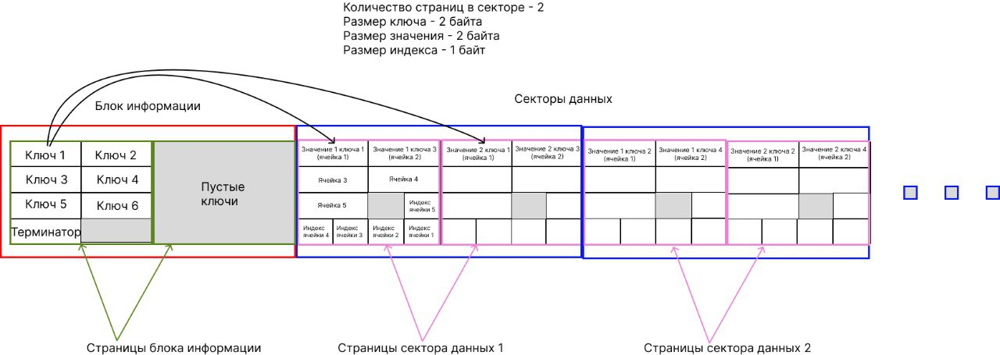

# Задача

Нужно написать тесты на класс для записи в энергонезависимую память (eeprom).

Eeprom используется при программировании микроконтроллеров для сохранения значений переменных
между перезапусками устройства. Например, можно запомнить яркость дисплея или громкость звука
и т. д.

В проекте по ссылке eeprom эмулируется, вместо него используется обычный файл. Поэтому тестировать
нужно на ПК. Класс который нужно протестировать - ``eeprom_safe_map_t``.

При тестировании использовать библиотеку googletest

# Проблема, которую решает eeprom_safe_map_t

Eeprom - это страничная память. Т. е. за раз можно записать или прочитать только всю страницу
целиком.

В eeprom сохраняются некоторые переменные, которые нужно периодически обновлять. Например,
можно записать значение переменной типа uint32_t (4 байта) в первую страницу по смещению 0.

После перезагрузки устройства значение можно восстановить из той же страницы по тому же смещению.

Чтобы обновить значение переменной, нужно перезаписать ту же страницу по тому же смещению.

У eeprom есть определенный ресурс записи, постепенно ячейки памяти отмирают и чтение/запись в
них становятся невозможны. Чтобы продлить жизнь eeprom нужно писать в разные области памяти.

В eeprom_safe_map_t используется следующий алгоритм: вместо того чтобы писать переменную в одно и
то же место, ее значение "размазывается" по нескольким страницам. Например, первая запись будет
сделана в страницу 1, вторая в страницу 2 и т. д., пока не будет достигнуто определенное
количество страниц, заданное пользователем этого класса.

Когда это количество будет достигнуто, запись снова начнется с 1 страницы, и так по кругу.

Если количество страниц, по которым крутится запись переменной равно, например, 16, то ресурс
eeprom будет расходоваться в 16 раз медленнее

## Интерфейс eeprom_safe_map_t

Класс имеет интерфейс словаря (std::map из C++), 2 основные функции:

- ``set_value`` - установить значение по заданному ключу
- ``get_value`` - получить значение по заданному ключу

Запись и чтение eeprom выполняется по кусочкам, в функции ``tick``, чтобы надолго не блокировать
поток управления.

Чтобы узнать, что операция (set_value, get_value и др.) выполнена, можно вызвать функцию ``ready``.
Любые операции можно вызывать только если класс находится в состоянии ``ready``.

Функция ``replace_key`` нужна в случаях когда в словаре не осталось свободного места. Она заменяет
один ключ на другой.

Функция ``reset`` удаляет всю ключи из мапы с помощью записи ключа-терминатора на место первого
ключа.

## Подробное описание алгоритма

Все доступные страницы разбиваются на 2 блока:

- блок информации
- секторы данных

Количество секторов и их размер рассчитывается автоматически исходя из количества
доступных страниц.

### Блок информации

В этом блоке находятся все ключи. Ключи - это идентификаторы переменных. Можно считать ключи
синонимом переменных. Например, идентификатором переменной громкость может быть число "1",
идентификатором переменной яркость может быть число "2" и т. д.

При вызове функции ``set_value(1, 123)``, будет создан ключ "1" со значением "123". Значение
записывается в секторы данных.

Если в ``get_value`` будет передан ключ, которого нет в мапе, то ``get_value`` вернет ``false``.

Блок информации может состоять из нескольких страниц eeprom. Количество необходимых страниц
рассчитывается исходя из заданных пользователем параметров при создании экземпляра класса.

Ключи располагаются друг за другом на страницах блока информации. После последнего ключа
всегда записывается ключ-терминатор, по которому можно определить конец списка ключей.

Если ключ не помещается на страницу целиком, то он будет полностью записан на следующей странице.

### Секторы данных

Секторы данных содержат значения ключей. 1 сектор данных состоит из нескольких страниц.
Каждому ключу соответствует 1 сектор. Но в 1 секторе могут храниться значения нескольких ключей.

Размер сектора задается в страницах и определяет, на сколько страниц будет размазываться значение
ключа. Если размер сектора - 16, то значение будет записываться по кругу в 16 страниц сектора.

У каждой страницы есть "ячейки". Одна ячейка соответствует одному значению одного ключа.
Ячейки нужны для переиспользования сектора.

Например, если страница eeprom равна 16 байт, а значения ключей имеют размер 4 байта, то на
одну страницу сектора могут поместиться 16 / 4 = 4 ячейки.

Первое значение сектора всегда будет записываться в первую ячейку каждой страницы.
Второе значение сектора всегда будет записываться во вторую ячейку каждой страницы.
И т. д.

Сначала заполняются все первые ячейки всех секторов. Когда количество ключей больше чем количество
секторов, начинают заполняться вторые ячейки, затем третьи и т. д.

Сектор ключа равен ``(порядковый_номер_ключа - 1) % количество_секторов``.
Ячейка ключа равна ``(порядковый_номер_ключа - 1) / количество_секторов``.

При добавлении нового ключа, сектор данных этого ключа заполняется байтом ``0xFF``.
Если в этом секторе уже есть значения других ключей, то заполнение не выполняется.

### Выбор актуального значения

Во время запуска программы, либо при вызове ``set/get_value``, в eeprom
находятся ключи и их значения. Каждому ключу соответствует сектор данных,
в секторе данных находятся несколько страниц. Следовательно и несколько значений.

Из всех этих значений нужно выбрать одно - то, которое было записано последним, оно является
актуальным.

Для поиска актуального значения в конце каждой страницы записываются индексы.
Один индекс соответствует одной ячейке. Соответственно, индексов в каждой странице столько же,
сколько и ячеек.

В момент записи значения, вместе со значением, в ту же страницу, записывается его индекс.
Индекс - это число от ``0`` до ``количество страниц в секторе + 1``. Когда индекс достигает
максимального значения, он снова отсчитывается с нуля. Т. к. значений индексов на 1 больше,
чем страниц, в значениях индексов образуется разрыв, который позволяет найти актуальное значение.

При поиске актуального значения по порядку считываются индексы значений со всех страниц.

- Если считанный индекс равен ``0xFF``, то актуальное значение найдено.
- Если текущая страница не равна нулю и текущий индекс отличается от предыдущего на **2**
  (для этого нужен +1 в максимальном значении индекса), то актуальное значение найдено.
- Если все индексы считаны, но разрыва в индексах найдено не было, то актуальное значение найдено.

Сам алгоритм находится в функции ``tick``, в состоянии ``find_actual_value``.

## Использование мапы

Перед первым использованием необходимо выполнить функцию ``reset``, чтобы добавился ключ-терминатор.
Без него класс не будет работать правильно.

